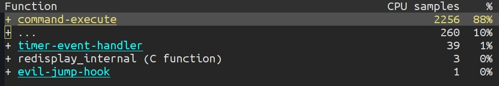
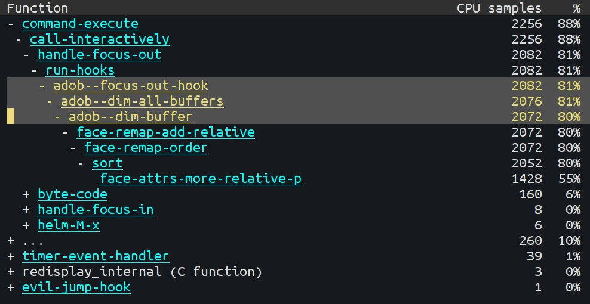

Emacs keeps running for several days on my machine and from time to
time I notice that it starts to get slow. I recently found a very easy
way to debug a slow emacs instance i.e. using the emacs profiler.

## Start the profiler

```
M-x profiler-start
```

You need to specify what is it that needs to be profiled i.e. cpu,
memory or both. Once the profiler is active, you need to perform the
operations that cause the delay. In my case, switching the focus in
and out of emacs was causing a delay. So, I just changed the focus a
couple of times so that the profiler could record the actions.

## Generate the report

```
M-x profiler-report
```

This gave me a detailed overview such as:



By expanding each item (default key for expand/collapse is `TAB`),
further split can be seen:



Clearly, I could see that the culprit was a hook that ran
everytime I was changing the focus. It turned out that the
`auto-dim-other-buffers-mode` was causing the problems. Disabling and
re-enabling the mode fixed the problem. Though this didn't fix the
root cause of the problem but the profiler helped me point out what
was the source of the problem.
