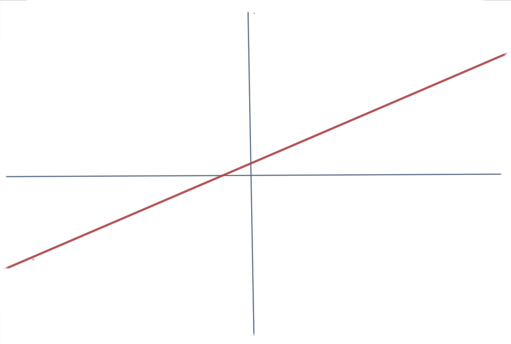
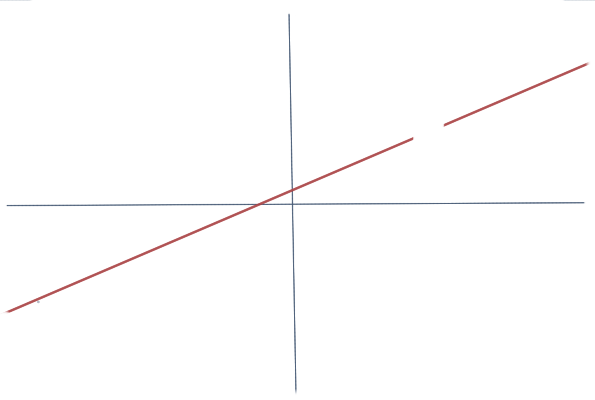
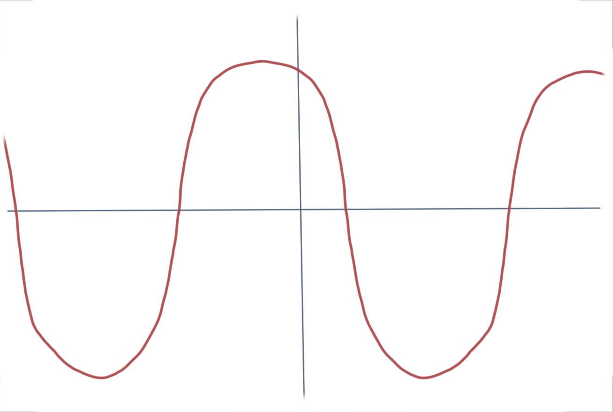
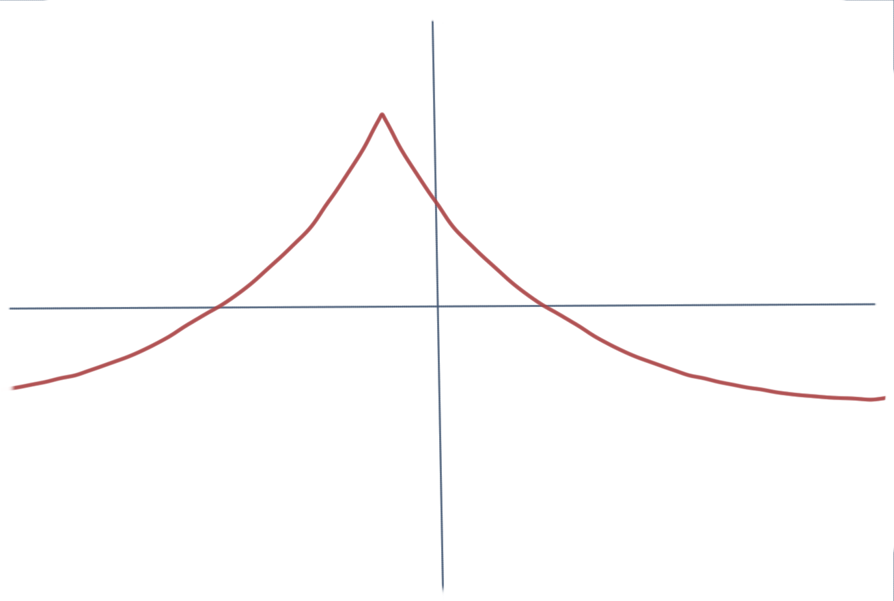
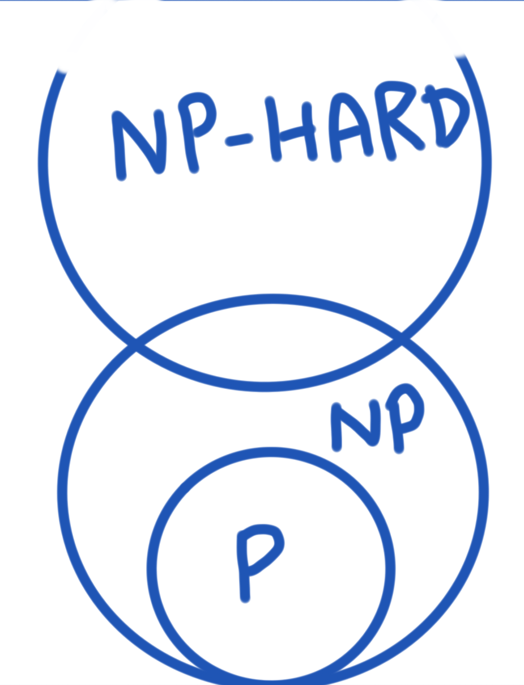
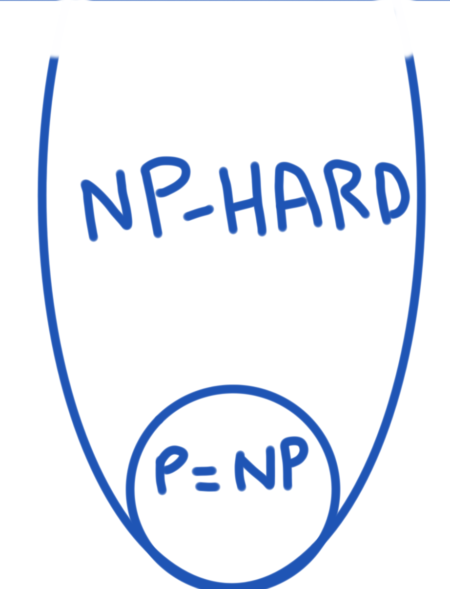

<!-- It seems that in order to understand something, humans need to ?? -->

Classifying things makes it easier for humans to talk about them. It is a
process in understanding the fundamental nature of those things and how they
relate to each other. This concept is called *Taxonomy* (initially used for
classification of living organisms). Examples are:

- Numbers: whole numbers, integers, real numbers etc
- Formal Languages of Computer Science (Chomsky hierarchy): Regular, Context
  Free, Context Sensitive, and Recursively Innumerable
- Computational Problems: P, NP, NP-Hard etc

I want to focus on the last category i.e **categories of Compuational Problems
and my intuition behind them**.

Before I begin, just want to say that the categories don't have to be mutually
exclusive. The only requirement is that elements in the categories need to share
some common characteristics and that doesn't stop them from belonging to multiple
categories.

# Classifying Problems
Categories of problems have been an elusive subject for me and it took me some
time to get an intuitive idea of what they mean and how they are different. When
I say problem, I am talking about a computational problem which is a question
that can be encoded in a form that a computer can understand e.g:

- What is 2+2?
- What is the shortest distance from A to B?

## Easy vs Difficult problems

A easy problem is one that doesn't take a lot of time or memory. For our
discussion, I will only focus on the time constraint.

If time is the only constraint, we can defined an easy problem that can be
solved **quickly**..

.. but what does **quick** mean?

Let's take run times for instances of two imaginary problems - Problem A and Problem B:

**Problem A:**

- For 10 elements, it takes 5 secs to run
- For 11 elements, it takes 10 secs to run

**Problem B:**

- For 10 elements, it takes 20 secs to run
- For 11 elements, it takes 21 secs to run

Now, even though the run times for examples of problem B are more than that of
problem A, the run times for problem A grows faster than B. If we think of
quickness in this way, solving problem B in the general sense is quicker than
problem A. If the input size is greater than 12, problem B will run faster than problem A.

This way of thinking about **quickness** can be expressed mathematically using
**polynomials**. Using polynomials makes the concept formal.. but what usually
happens is that the formal version doesn't do a good enough job at making the
idea intuitive.

### What is a polynomial .. intuitively?

Instead of explaining what a polynomial is, let me ask you the difference
between the following two graphs:

<p>
  
  &nbsp;
  
</p>

or these two:

<p>
  
  &nbsp;
  
</p>

The graphs on the left are continuous and smooth i.e. they don't break, don't
have any holes in them, they don't have any points (cusps).. It turns out that
**polynomials can be visualized as smooth and continuous**.. or you can also say
that they are smooth and continuous functions since we are visualizing a
function of the form *y = f(x)*. I am not saying that all smooth and continuous
functions are polynomials but all polynomials look like smooth and continuous
functions. Of course, this is an over simplification of what a polynomial is but
for me this simplification helps me get some intuition of the idea.

Literally, the word polynomial means multiple terms and mathematically it is a
sum of algebraic expressions e.g.

```
x^2 + 3x + 4
```

Variables in polynomials can only have powers that are whole numbers i.e. 0, 1,
2, 3. So something like `1/x` is not a polynomial.


### So.. what does 'quick' mean in terms of polynomials? ###

An easy problem is one that can be solved quickly i.e. **if we can express the
total running time of the problem as a polynomial**, that would be an easy
problem.

Or In other words, **if we can express the relationship of the input
size and the total running time as a polynomial**, we can categorize it as an
easy problem.

Let's look as an example:

- Given a list of numbers, does number `42` exist in the list?

In order to find out whether 42 exists in the list, we have to go through all
the numbers in the list. So for a list of size 10, we have to look at 10 items
at most. For a list of size 1000, we have to look at 1000 items. By increasing one item to the list, we increase one lookup. Hence, we can express the running time as:

```
running time = k . n
```

where:

- *n* is the number of items,
- *k* is some constant that is the cost of performing a lookup for an item

Since `k . n` is a polynomial, we categorize this as an easy problem.

This category of problems is known as **P problems** which stands of Polynomial
time and is the official term for this category of problems.

### Difficult Problems ###

A difficult problem would be one that can't be solved quickly. However, **given a
solution it should be possible to quickly verify that the solution is correct**.

If we use the same notion of quickness discussed earlier, we can define
difficult problems as **problems that can be verified in polynomial time**.

Such problems are formally known as *NP Problems* which stands for
Non-deterministic polynomial time. Why such a difficult name? Well it comes from
the concept of Non-deterministic Turing machines, which are capable of
branching at every step of the problem and the whole thing runs in polynomial
time. Such a machine is theoretical and only used in thought experiments.

<!-- Example: What is the path from A to B that  -->

## Even more difficult problems ##

There are problems that can't even be verified in polynomial time. Such problems are formally known as **NP-Hard**.

<!-- Example: What is the shortest path from A to B? -->

## Impossible Problems ##
There are some problems that can't be solved in a general sense i.e. for all possible inputs. If we try to solve them, the computer will take forever to solve and never return an answer. Formally, these problems are known as **Undecidable problems**.

An example would be, **given a computer problem, find out if it has a security bug or not**. You can think of some types of computer programs for which you can easily find out whether they have a bug or not. However, you can't do it for all types of computer programs that can possibly exist.

The most famous impossible problem is known as the **Halting problem** which is **given a program, will it ever solve or will it keep executing?** This can't be solved in a general sense.

<!-- ### Brute forcing the impossible problems -->

# Recap

Here are the 4 categories discussed:

- **P** (Easy): Can be **solved in polynomial time**
- **NP** (Difficult): Can be **verified in polynomial time**
- **NP-Hard** (Even More Difficult): In addition to the hardest problems in NP, they also contain problems that **cannot be verified in polynomial time**
- **Undecidable** (Impossible): Cannot be solved at all

# How do we find out the category for a problem?

Categorizing a problem is related to discovering an algorithm for it. We
categorize problems as NP or NP-Hard because **we are not aware of any
algorithms that can run faster**. If we discover an algorithm that runs faster,
the problem gets a different category assigned to it.

# How do these categories overlap?

No one knows the answer to this question at the moment. Basically, this boils
down to the infamous *P = NP* [millennium problem][mellenium] which asks the
question, does there exist a polynomial time algorithm that solves an NP
problem? If such an algorithm existed, we wouldn't need the NP category since
the P and NP would be the same as P. Most people think that no such algorithm
exists but it hasn't been mathematically proven yet.

The two different ways to think about the categories overlapping is:

<p>
  
  &nbsp;
  
</p>

If you can prove one or the other, you get a [million dollars as a reward for solving this mystery][prize].

[mellenium]: http://www.claymath.org/millennium-problems
[prize]: http://www.claymath.org/millennium-problems/millennium-prize-problems

<!-- Jdog's review: -->
<!-- make links: target=_blank -->
<!-- more explanation for the difficult problems -->
<!-- didn't get the intuitive explanation about the polynomials -->
<!-- - more like didn't understand the 'why' part i.e. why can they be visualized as smooth and continuous -->
