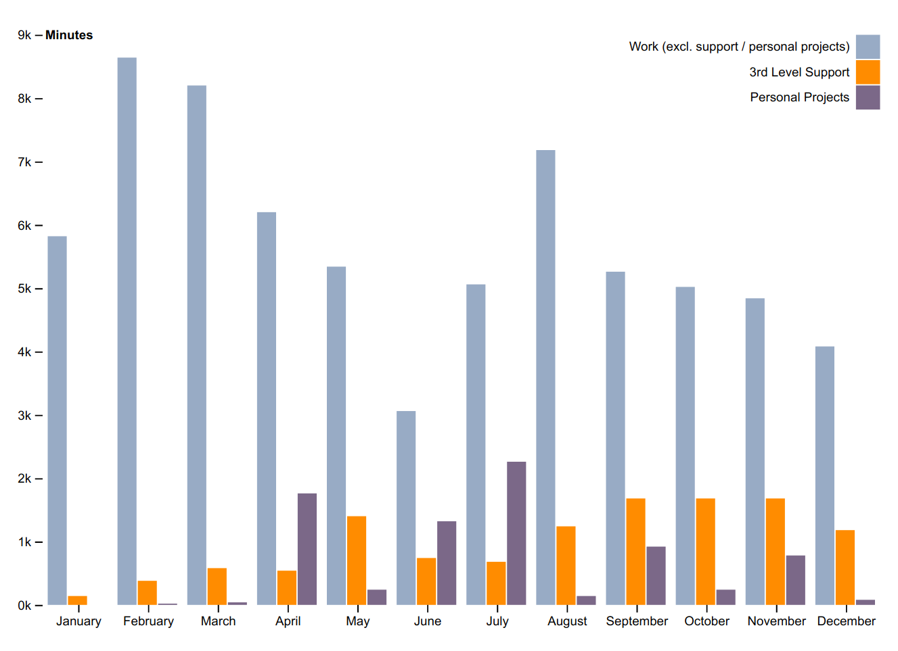

2016 had gone by in a flash. By the end of it, I was trying to figure out *what
the hell* did I do for the whole year - I couldn't remember squat! It was
difficult to recall what had happened a few weeks back, let alone what happened
months ago.

It was perfect timing for a new year's resolution - **maintain a log of how I
spend my time.**

I needed something that could blend into my workflow instead of being a
distraction. The requirements were simple:

- Creating a new journal entry should be easy
- Time spend on an activity should be automatically calculated
- It should be easy to generate a time summary for the day

Being a long **Emacs** user, I went with the obvious
choice - [Org journal][org-journal].

Here is how it looks after a full year of tracking my activities:

Not surprisingly, I can see that during the months where I have been busy with
support, I haven't been able to spend much time on other activities such as
feature development, bug fixes, etc.

In case you are interested how I crunched the data, I have been working on a
simple library using Clojure that reads the journal files, extracts the time
summaries and calculates total times. You can check it out
here: [org-clock-stats][org-clock-stats].

[home-row]: https://en.wikipedia.org/wiki/Touch_typing#Home_row
[spacemacs]: spacemacs.org
[org-journal]: https://github.com/bastibe/org-journal
[org-clock-stats]: https://github.com/ahmadnazir/org-clock-stats
