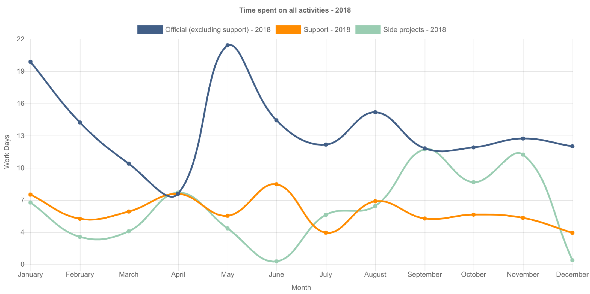
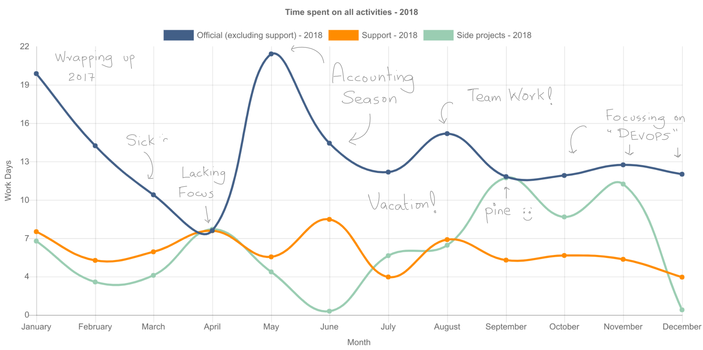

For the last 2 years, I have been keeping a record of most tasks I work on. The
idea is perform *objective* retrospectives i.e. rely on data rather than a
feeling to evaluate how things are going. Most of my tasks are done while
sitting in front of a screen, so for me, the strategy that I have devised has
been working fairly well. Maybe in a few years or in a different life when I
don't have to work with computers all the time, I'll have to think of a
different way to track my activities. Nevertheless, the process works for me. It
requires some discipline but in the end it helps me figure out a *personal why*
or *vision*, gives me direction and helps me communicate better with my peers.

## What type of activities do I care about?

I try to label most of my tasks but broadly I want to track the following 3 types:

- **Official:** Anything work related i.e. feature development, bug fixes,
  discussions, etc. The only exception to this is time spent on *support*...
- **Support:** These are mean menial tasks and are usually low impact. Also,
  they could have been automated but for some reason they weren't.
- **Side projects:** This is the work that drives me. I wouldn't mind spending
  my weekends doing this type of work and in an ideal world I would only do
  these types of tasks.

I can't track everything and don't try to track everything. For example,
tracking the time spend on every discussion with a colleague can be resource
intensive by itself and it doesn't serve any purpose. The idea is to keep focus
by tracking planned activities and use the discipline to minimize distractions.

## How did 2018 go?

A simple way to visualize how the year went is to sum of the time spent on
different types of activities. This is how 2018 looked for me:

Well, what does it mean? Without any context it means...  didly squat! The different
times of the year need to be correlated with what happened back then. This is
where monthly retrospectives are helpful. 

Here is an lightly annotated version which is more meaningful:

The annotated version helps... but it would be amazing if I could also know how
I felt during the whole year. Just working more or or less on something doesn't
mean that I felt inspired or not. So one of things that I am planning on trying
out for the next year is also track morale at different times of the year (using
an app like [Dailio][dailio]). This is good enough for now.

[dailio]: https://daylio.webflow.io/

